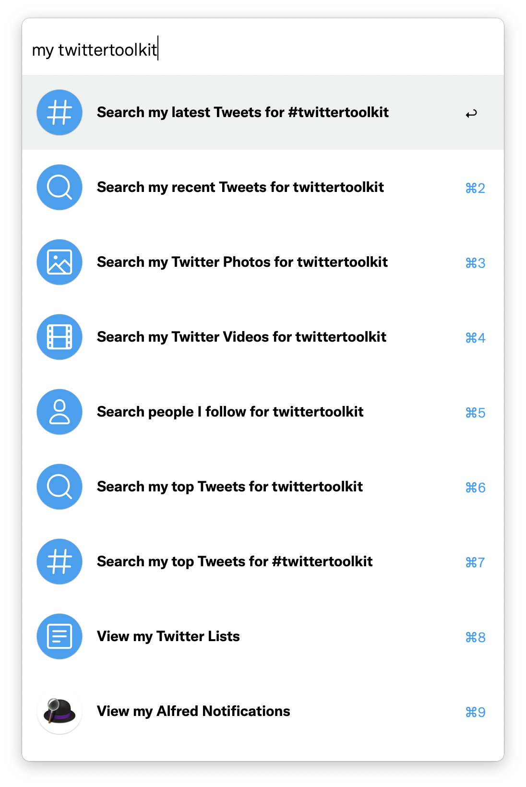

# Twitter Toolkit for Alfred

The Twitter Toolkit for Alfred lets you quickly interact with Twitter through its website, [Mac app](https://apps.apple.com/us/app/twitter/id1482454543?mt=12&uo=4), and [Tweetbot](https://tapbots.com/tweetbot/mac/).

It makes it easy to quickly search and find your own content or the content of people you follow (shown using the <a href="../../themes/hey">Hey Theme</a>):

This extension doesn't support programmatic access to Twitter, like tweeting directly or sending DMs. For that kind of integration, try [AlfredTweet](http://dferg.us/alfredtweet-2/) by David Ferguson.

# Installation

1. Download [twitter-toolkit.alfredworkflow](https://github.com/chrismessina/alfred-twitter-toolkit/raw/main/twitter-toolkit.alfredworkflow).
2. Double-click `twitter-toolkit.alfredworkflow` to install it.

_You will need to be an [Alfred Powerpack](https://www.alfredapp.com/powerpack/) user to enable this workflow._

# Configuration

Once the workflow is installed, launch **Alfred Preferences**, choose **Workflows** and then select **Twitter Toolkit**.

➊ Access the **Workflow Environment Variables** in the top right of the window :

## Set your username

This workflow makes it easy to search your own tweets or find content from the people you follow ("followees").

➋ To configure this feature, you must set the `account` variable in the configuration .

## Platform selection

This workflow supports interacting with Twitter on the web, Twitter for Mac, or Tweetbot. If a keyword is not supported by a certain platform, it will fallback to the web.

➌ Set the `platform` variable to  `web`,  `app` or `tweetbot` .

# Keywords

The following keywords are used to interact with the Twitter Toolkit.

Modifier keys change the behavior as described, and subtext will appear in Alfred to help guide your interaction.

⌥ is typically used to scope content to your own content.

⌘ is typically used to scope content from people you follow.

⇧ is used to toggle the nearby scope.

|   Keyword    	|   Modifier  	|   Description                                             	|     	|     	|     	|
|--------------	|:-----------:	|-----------------------------------------------------------	|:------:	|:------:	|:-----------:	|
|  `!        `  	|             	|   View my Twitter Notifications                           	|    ☑️   	|    ☑️   	|       ☑️     	|
|  `@        `  	|             	|   Go to Twitter user @{query}                             	|    ☑️   	|    ☑️   	|       ☑️     	|
|  `@        `  	|       ⌥     	|   Search Twitter users for @{query}                       	|    ☑️   	|    ☑️   	|       ☑️     	|
|  `#        `  	|             	|   Search Twitter for #{query}                             	|    ☑️   	|    ☑️   	|             	|
|  `#        `  	|             	|   Go to #{query}                                          	|    ☑️   	|        	|             	|
|  `#        `  	|       ⌘     	|   Search my tweets for #{query}                           	|    ☑️   	|        	|             	|
|  `analytics`  	|             	|   Go to Twitter Analytics                                 	|    ☑️   	|        	|             	|
|  `bookmarks`  	|             	|   Go to Twitter Bookmarks                                 	|    ☑️   	|    ☑️   	|       ☑️     	|
|  `dm       `  	|             	|   Compose a Twitter message                               	|    ☑️   	|    ☑️   	|             	|
|  `dms      `  	|             	|   Go to Twitter messages                                  	|    ☑️   	|    ☑️   	|       ☑️     	|
|  `embed    `  	|             	|   Embed tweet                                             	|    ☑️   	|        	|             	|
|  `explore  `  	|             	|   See what’s happening                                    	|    ☑️   	|    ☑️   	|             	|
|  `follow   `  	|             	|   Follow @{query} on Twitter                              	|    ☑️   	|        	|       ☑️     	|
|  `help     `  	|             	|   Go to Twitter Help Center                               	|    ☑️   	|        	|             	|
|  `home     `  	|             	|   Go to Twitter Home                                      	|    ☑️   	|    ☑️   	|       ☑️     	|
|  `images   `  	|             	|   Search Twitter images for {query}                       	|    ☑️   	|    ☑️   	|             	|
|  `images   `  	|       ⌥     	|   Search my Twitter images for {query}                    	|    ☑️   	|    ☑️   	|             	|
|  `images   `  	|       ⌘     	|   Search Twitter images from people I follow for {query}  	|    ☑️   	|    ☑️   	|             	|
|  `inbox    `  	|             	|   Go to Twitter messages                                  	|    ☑️   	|    ☑️   	|       ☑️     	|
|  `lists    `  	|             	|   View Suggested Twitter Lists                            	|    ☑️   	|    ☑️   	|             	|
|  `lists    `  	|       ⌥     	|   View my Twitter Lists                                   	|    ☑️   	|        	|       ☑️     	|
|  `lists    `  	|       ⌘     	|   View Twitter Lists You’re On                            	|    ☑️   	|        	|             	|
|  `me       `  	|             	|   View my profile on Twitter                              	|    ☑️   	|    ☑️   	|       ☑️     	|
|  `me       `  	|       ⌥     	|   Copy my Twitter profile link                            	|    ☑️   	|        	|             	|
|  `media    `  	|             	|   Go to Twitter Media Studio                              	|    ☑️   	|        	|             	|
|  `my       `  	|             	|   Search people I follow for {query}                      	|    ☑️   	|    ☑️   	|             	|
|  `messages `  	|             	|   Go to Twitter messages                                  	|    ☑️   	|    ☑️   	|       ☑️     	|
|  `my       `  	|             	|   Search my top tweets for {query}                        	|    ☑️   	|    ☑️   	|             	|
|  `my       `  	|             	|   Search my recent tweets for {query}                     	|    ☑️   	|        	|             	|
|  `my       `  	|             	|   Search my tweets for #{query}                           	|    ☑️   	|    ☑️   	|             	|
|  `my       `  	|             	|   Search my Twitter videos for {query}                    	|    ☑️   	|    ☑️   	|             	|
|  `my       `  	|             	|   View my Twitter Likes                                   	|    ☑️   	|        	|       ☑️     	|
|  `my       `  	|             	|   View my Twitter Media                                   	|    ☑️   	|        	|             	|
|  `my       `  	|             	|   View my Twitter Moments                                 	|    ☑️   	|        	|             	|
|  `my       `  	|             	|   View my Twitter Lists                                   	|    ☑️   	|    ☑️   	|       ☑️     	|
|  `my       `  	|             	|   View my Twitter Bookmarks                               	|    ☑️   	|    ☑️   	|       ☑️     	|
|  `my       `  	|             	|   View my Twitter Notifications                           	|    ☑️   	|    ☑️   	|       ☑️     	|
|  `nearby   `  	|             	|   Search nearby Twitter photos for {query}                	|    ☑️   	|    ☑️   	|             	|
|  `nearby   `  	|             	|   Search nearby Twitter videos for {query}                	|    ☑️   	|    ☑️   	|             	|
|  `nearby   `  	|             	|   Search nearby Twitter people for {query}                	|    ☑️   	|    ☑️   	|             	|
|  `new      `  	|             	|   New Tweet with text {query}                               |    ☑️   	|    ☑️   	|       ☑️     	|
|  `notifs   `  	|             	|   View my Twitter Notifications                           	|    ☑️   	|    ☑️   	|       ☑️     	|
|  `photos   `  	|             	|   Search Twitter photos for {query}                       	|    ☑️   	|        	|             	|
|  `photos   `  	|       ⌘     	|   Search Twitter photos from people I follow for {query}  	|    ☑️   	|        	|             	|
|  `photos   `  	|       ⇧     	|   Search nearby Twitter photos for {query}                	|    ☑️   	|        	|             	|
|  `reply    `  	|             	|   Create a link in-reply-to a Tweet                        	|    ☑️   	|        	|             	|
|  `top      `  	|             	|   Search top tweets for {query}                           	|    ☑️   	|        	|             	|
|  `topics   `  	|             	|   View my Twitter Topics                                  	|    ☑️   	|    ☑️   	|             	|
|  `trending `  	|             	|   See what’s happening                                    	|    ☑️   	|    ☑️   	|             	|
|  `trending `  	|       ⌥     	|   See what’s happening for you                            	|    ☑️   	|        	|             	|
|  `tweet    `  	|             	|   Compose new Tweet                                       	|    ☑️   	|    ☑️   	|       ☑️     	|
|  `tweets   `  	|             	|   Search Twitter for {query}                              	|    ☑️   	|    ☑️   	|       ☑️     	|
|  `tweets   `  	|             	|   Search top tweets from people I follow for {query}      	|    ☑️   	|    ☑️   	|             	|
|  `tweets   `  	|             	|   Search recent tweets from people I follow for {query}   	|    ☑️   	|    ☑️   	|             	|
|  `tweets   `  	|       ⌥     	|   Search my recent tweets for {query}                     	|    ☑️   	|        	|             	|
|  `unfollow `  	|             	|   Unfollow @{query} on Twitter                            	|        	|        	|       ☑️     	|
|  `users    `  	|             	|   Search Twitter users for {query}                        	|    ☑️   	|    ☑️   	|             	|
|  `users    `  	|       ⌘     	|   Search Twitter users I follow for {query}               	|    ☑️   	|    ☑️   	|             	|
|  `users    `  	|       ⇧     	|   Search nearby Twitter people for {query}                	|    ☑️   	|    ☑️   	|             	|
|  `videos   `  	|             	|   Search Twitter videos for {query}                       	|    ☑️   	|    ☑️   	|             	|
|  `videos   `  	|             	|   Search Twitter videos from people I follow for {query}  	|    ☑️   	|    ☑️   	|             	|
|  `videos   `  	|       ⇧     	|   Search nearby Twitter videos for {query}                	|    ☑️   	|    ☑️   	|             	|
|  `videos   `  	|       ⌘     	|   Search my Twitter videos for {query}                    	|    ☑️   	|    ☑️   	|             	|

#Tips

One of the most convenient features of this workflow is the ability to quickly search for your own tweets and tweeted media. By using the `my` keyword followed by search terms, you can quickly continue previous threads or link to things you said before.

# Changelog[¹](https://keepachangelog.com/)

## [v0.3.4] - 2020-11-26
### Added
- Added synonym keywords `inbox` and `messages`
- Added keyword `reply` to create a new status in-reply-to a tweet
- Added keyword `new` for composting a new tweet; added {query} to this object to preview text

### Changed
- Updated OneUpdater to new repository
- Updated Twitter and Tweetbot icons

### Fixed
- Tweak the way `me` works to take an optional argument.
- Replaced several instances of "Twitter" with `{var:service}`
- Hooked up OneUpdater so it'll do its thing!

## [v0.3.3] - 2020-09-17
### Fixed
- Quick fix for errant curly brace in `Go to hashtag` query.

## [v0.3.2] - 2020-09-07
### Fixed
- Quick fix for missing non-personalized `users` query.

## [v0.3.1] - 2020-09-06
### Fixed
- Replaced "(from:{var:account})" with "from:{var:account}" (no parens) from app searches.
- Fixed on errant search that targeted videos rather than all tweets.

## [v0.3.0] - 2020-09-04
### Added
- Support for [Tweetbot URL Schemes](https://tapbots.net/tweetbot4/support/url-schemes/) by setting `tweetbot` as `platform` variable (thanks [@bemawr](https://www.alfredforum.com/profile/16163-bemawr/ )!) (Closes [#3](https://github.com/chrismessina/alfred-twitter-toolkit/issues/3))
- Support for `nearby` searches:
  - tweets
  - photos
  - videos
  - users
- keywords to go to:
  - hashtag page
  - topics
  - Alternative keyword `!` for notifs
- Descriptive notes in Workflow
- OneUpdater (Closes [#6](https://github.com/chrismessina/alfred-twitter-toolkit/issues/6))

### Changed
- Added `service` and `domain` variables to make it easier to develop other Toolkits
- Drastically increased support for Twitter for Mac thanks to new routes included in 8.34 (thanks [@nolanobrien](https://twitter.com/@nolanobrien)!) (Closes [#4](https://github.com/chrismessina/alfred-twitter-toolkit/issues/4))

### Removed
- followees keyword

## [v0.2.0] - 2020-08-17
### Added
- All new icons!
- Support for new keywords: `analytics`, `explore`, `help`, `media`, `notifs`
- New additions to the "my" collection: Bookmarks, Lists, Moments, Notifications

## [v0.1.0] - 2020-08-06
- Initial Release

# About

This workflow is unaffiliated with nor endorsed by Twitter.

You can [file bugs](https://github.com/chrismessina/alfred-twitter-toolkit/issues/new) or [submit feature requests](https://github.com/chrismessina/alfred-twitter-toolkit/issues/new) on GitHub using the label `workflow:twitter-toolkit`.
